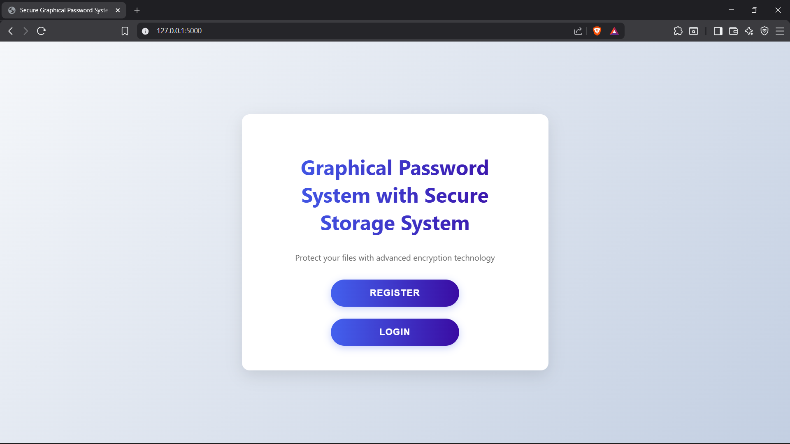
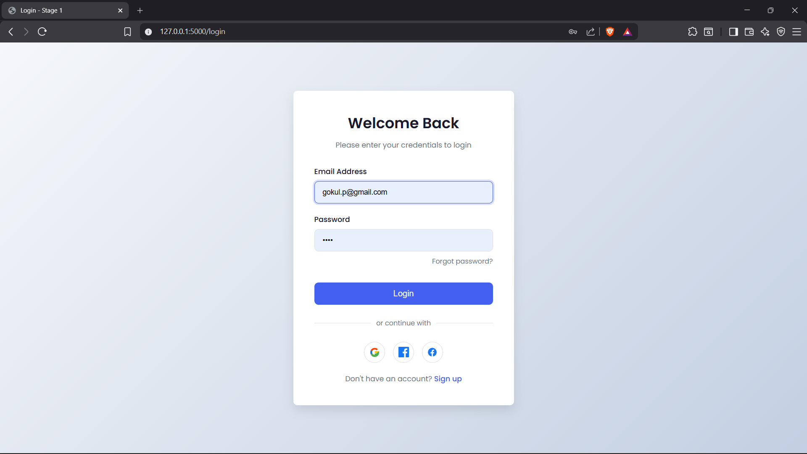
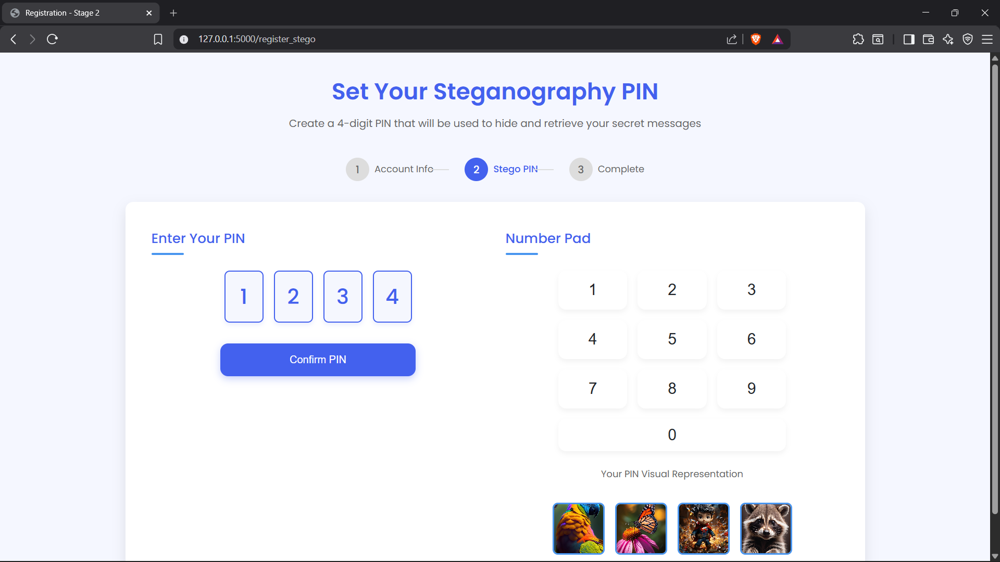
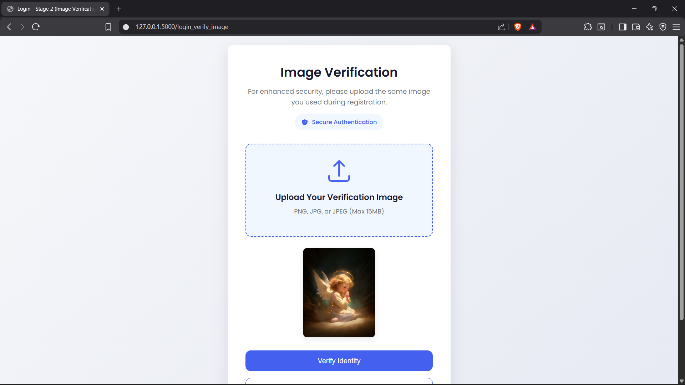
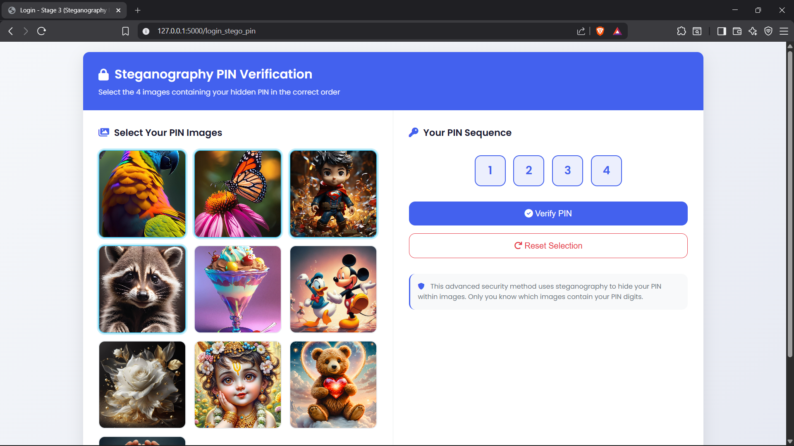
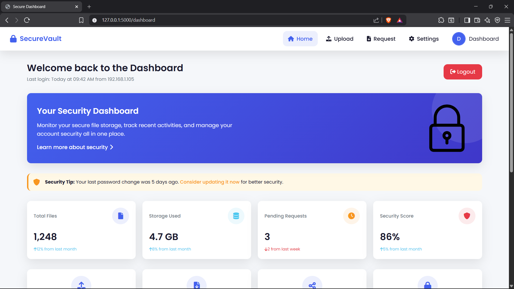
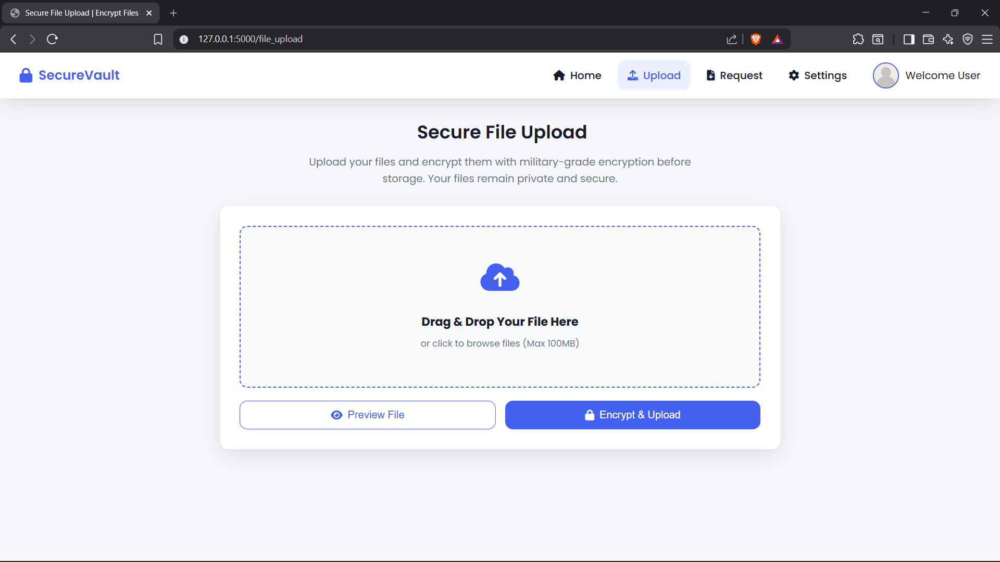
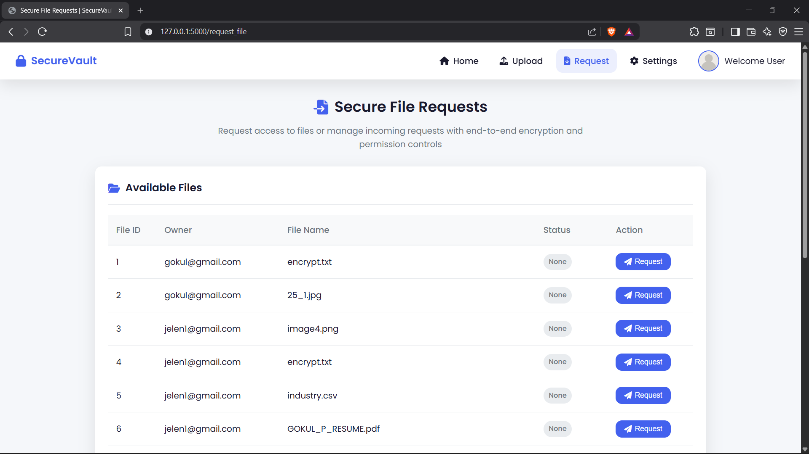

# Graphical Password Authentication With Data Hiding


## Overview


Graphical Password Authentication With Data Hiding is a multi-layer authentication and secure file storage system developed using Flask, OpenCV, AES Encryption, DWT Steganography, and SQLite.


The system enhances traditional password-based authentication by combining graphical passwords, image verification, and steganography-based PIN authentication. It also provides secure encrypted file storage and file-sharing capabilities.


---


## Features


* Multi-Step User Authentication

* Graphical Password Verification

* Image-Based Authentication

* Steganography PIN Verification

* AES File Encryption

* Secure File Upload

* Secure File Requests

* User Dashboard

* Account Management

* File Access Control

* SQLite Database Integration


---


## Tech Stack


### Backend


* Python

* Flask


### Security Technologies


* AES Encryption

* DWT Steganography

* Graphical Password Authentication


### Libraries


* OpenCV

* NumPy

* PyCryptodome

* PyWavelets


### Database


* SQLite


### Frontend


* HTML

* CSS

* JavaScript


---


## Project Screenshots


### Home Page





### Registration Page


### Login Page





### Steganography PIN Setup





### Image Verification





### Steganography PIN Verification





### Dashboard





### Secure File Upload





### Secure File Requests





---


## Installation


### Clone Repository


```bash

git clone https://github.com/Iamgokul7/Graphical-Password-Authentication-With-Data-Hiding.git

```


### Navigate to Project Folder


```bash

cd Graphical-Password-Authentication-With-Data-Hiding

```


### Install Dependencies


```bash

pip install Flask numpy pycryptodome pywavelets opencv-python boto3

```


### Run Application


```bash

python app.py

```


### Open Browser


```text

http://127.0.0.1:5000

```


---


## Project Structure


```text

Graphical-Password-Authentication-With-Data-Hiding

│

├── static/

├── templates/

├── screenshots/

├── app.py

├── req.txt

├── README.md

└── users.db

```
## Documentation

### Project Report
- [View Project Report](REPORT%20ON%20ENHANCED%20SECURITY%20FRAMEWORK%20%20GRAPHICAL%20PASSWORD%20AUTHENTICATION%20WITH%20DATA%20HIDING%20ON%20CL.pdf)

### Project Presentation
- [View Project Presentation](PPT%20ENHANCED%20SECURITY%20FRAMEWORK%20%20GRAPHICAL%20PASSWORD%20AUTHENTICATION%20WITH%20DATA%20HIDING%20ON%20CL.pptx)

### Survey Paper
- [View Survey Paper](SURVEY%20REPORT%20ON%20ENHANCED%20SECURITY%20FRAMEWORK%20%20GRAPHICAL%20PASSWORD%20AUTHENTICATION%20WITH%20DATA%20HIDING%20ON%20CL.pdf)


---


## Author


**Gokul P**


Bachelor of Engineering (Computer Science Engineering)


2025 Graduate


